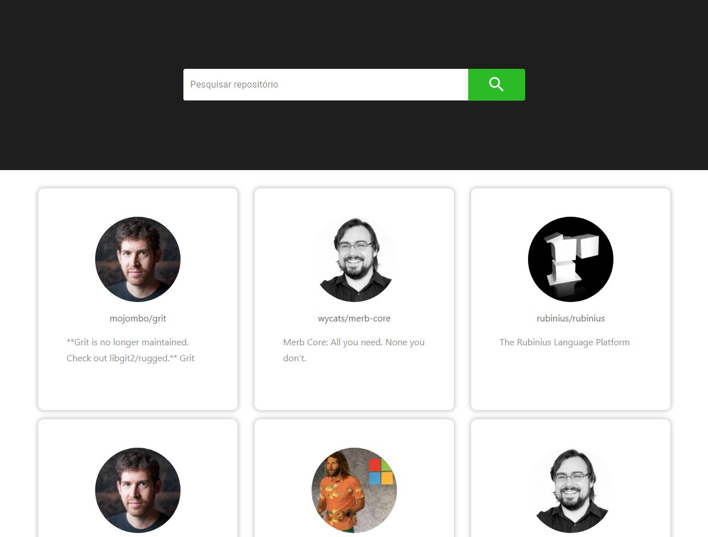

## Github API




Projeto criado consumindo api do github utilizando swr para cache dos dados e melhor experiência de navegação do usuario.

<h2> 👨🏻‍💻 Tecnologias utilizadas:  </h2>

<ul>
  <li>React</li>
  <li>Styled Components</li>
  <li>Bootstrap 4</li>
  <li>Material UI</li>
  <li>Swr Vercel</li>
  <li>Axios</li>
  <li>Jest</li>
  <li>Moment Js</li>
</ul>

1- Baixar dependências: 
```javascript
 yarn
```

2- Executar Aplicação:
```javascript
   yarn start
```
